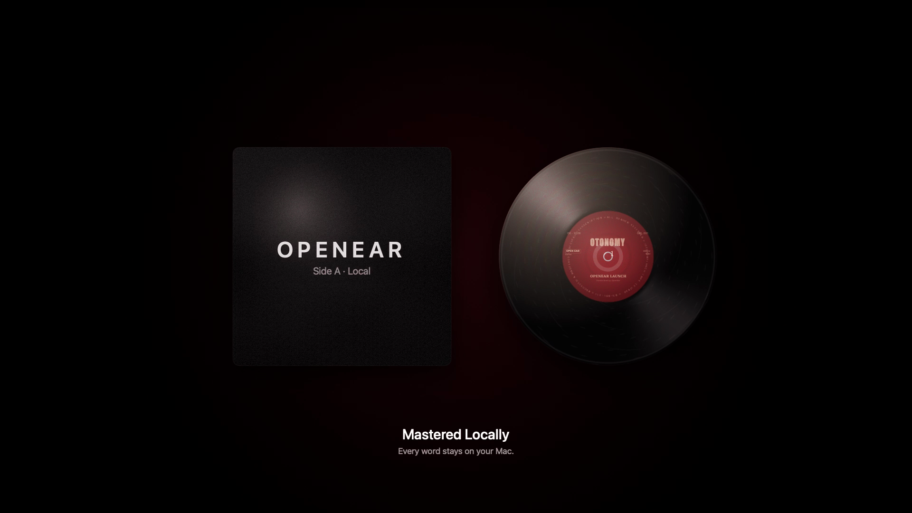
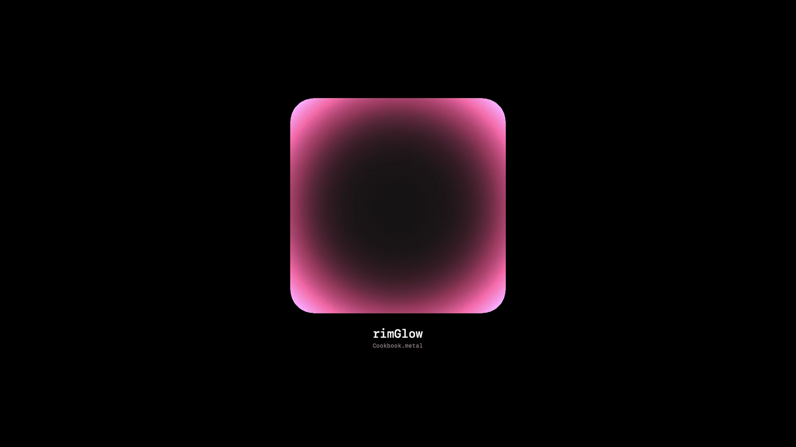
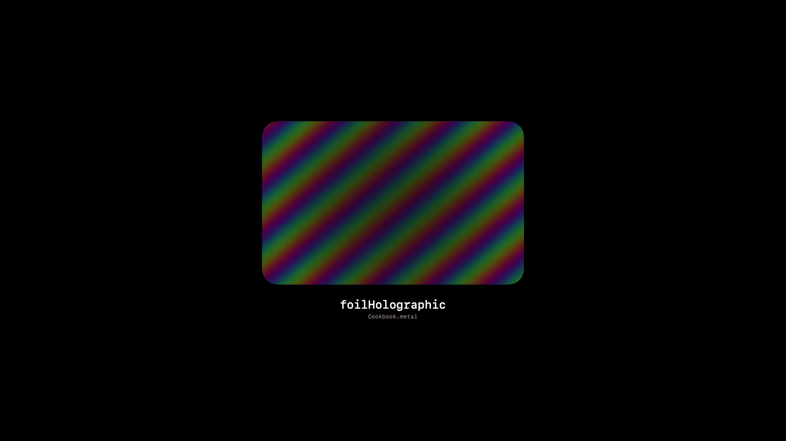
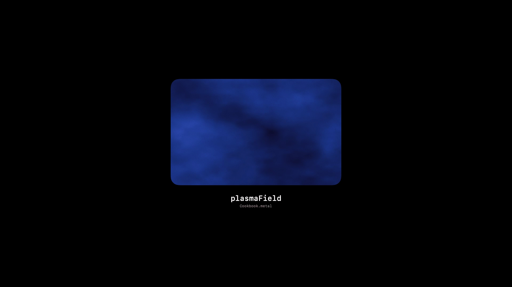
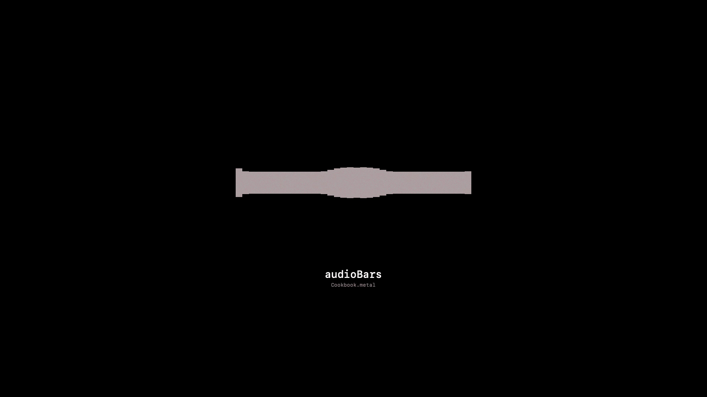
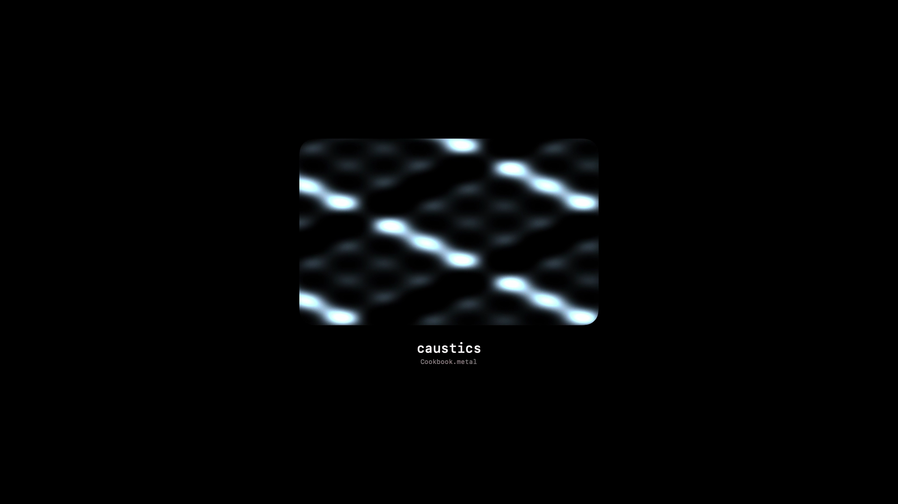
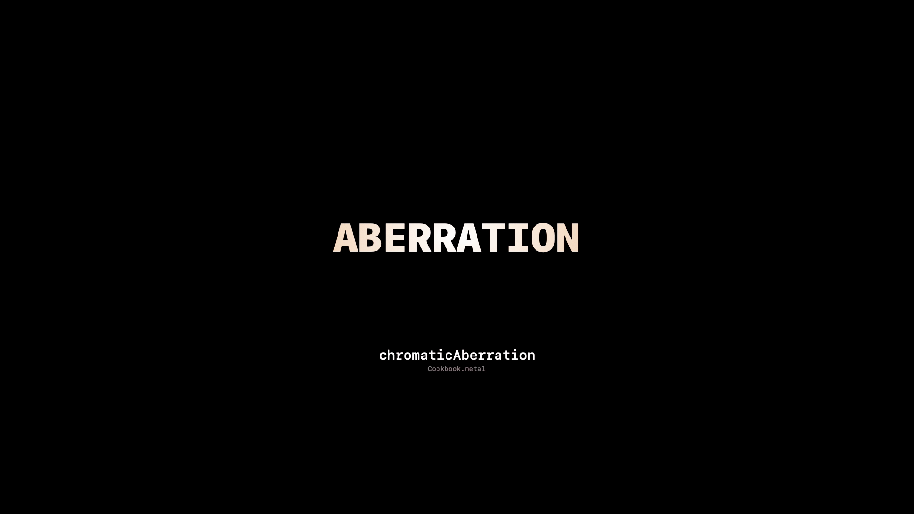
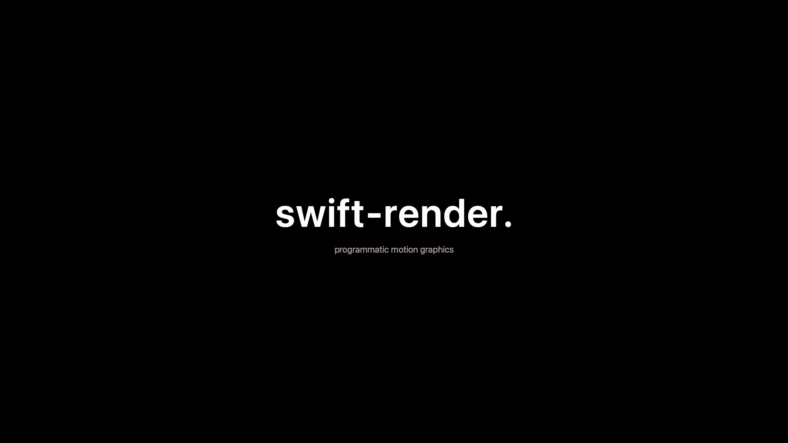
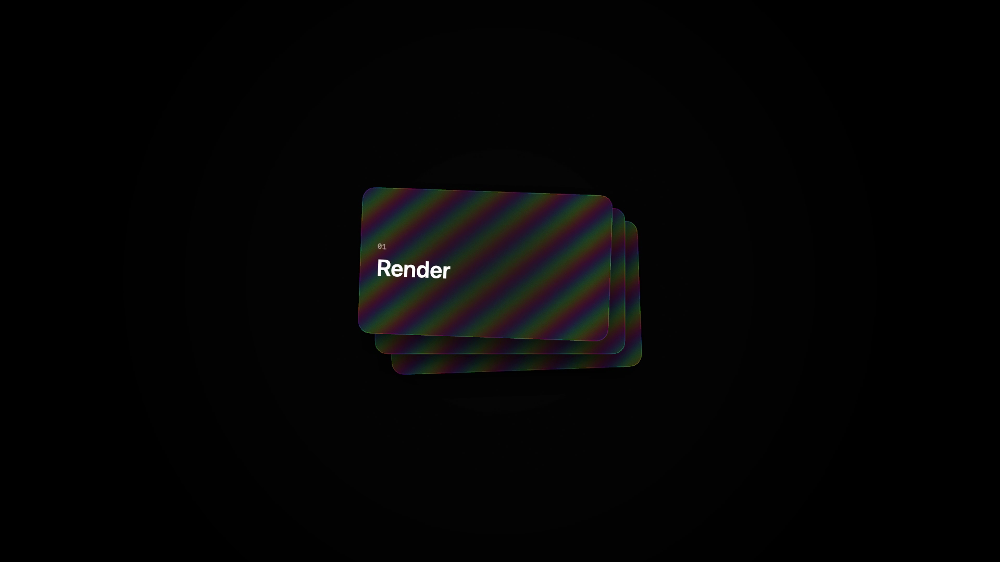
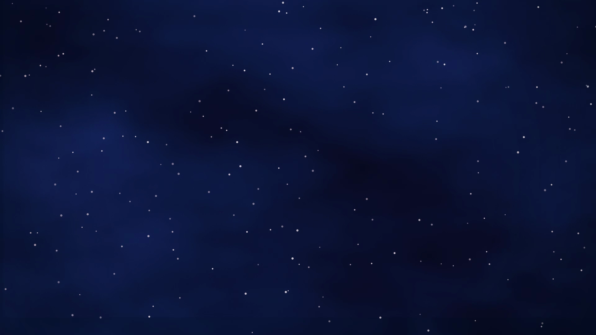

# swift-render

**Programmatic motion graphics in Swift. SwiftUI scenes + real Metal shaders → MP4.**

The Apple-ecosystem answer to Remotion / After Effects. Built for an era where AI writes the motion graphics.



*Above: real-world scene from the OpenEar app launch — a Metal-shaded vinyl record with anisotropic specular and groove micro-patterns, beside a glossy album sleeve (also shader-rendered), captioned with SwiftUI text. Every frame is a pure function of time.*

```bash
swift run swift-render render TextReveal --out out/hero.mp4
swift run swift-render render ShaderShowcase --out out/cookbook.mp4
swift run swift-render render LaunchReel --aspect 9:16 --out out/vert.mp4
```

---

## Why this exists

**Remotion** is React rendered by headless Chromium. Slow (30–60fps), JS-only, no GPU shaders, no native Apple typography. **After Effects** is a closed app. **Motion Canvas** is TypeScript. There's been no good native-Apple programmatic motion graphics framework.

swift-render fills that gap with three things that matter:

1. **Native SwiftUI rendering** — CoreAnimation interpolation, real Apple typography, SF Symbols, glassmorphism, `.colorEffect`/`.layerEffect` shaders. ~100fps render speed.
2. **Real Metal shaders.** Drop a `.metal` file into the package, call it via `ShaderLibrary.bundle(.module).yourShader(...)` on any view. Iridescent foil, animated noise, caustics, audio-reactive bars — all real GPU code.
3. **Frame-deterministic scene API.** Every scene is a pure function of `t: Double`. No `@State`, no `Timer.publish`, no `withAnimation` race conditions. LLM-shaped.

That last point is the kicker for AI workflows. Remotion has hooks, `useCurrentFrame`, refs, effect deps — LLMs get those wrong. swift-render has `t: Double`. That's it. Write a SwiftUI scene as a pure function of time, get an MP4.

---

## Quick start

```bash
git clone https://github.com/<you>/swift-render.git
cd swift-render
swift build
swift run swift-render list             # list available scenes
swift run swift-render render TextReveal --out out/hello.mp4
```

Output is a real H.264 MP4 at `out/hello.mp4`. Frame-deterministic, ~100fps render speed at 1080p.

## Writing a scene

```swift
import SwiftUI

public struct MyHero: RenderScene {
    public static let defaultDuration: Double = 3.0
    public static func body(at t: Double, duration: Double) -> some View {
        let p = Ease.easeOut(Ease.clip(t, 0.0, 0.6))
        Text("hello.")
            .font(.system(size: 96, weight: .semibold))
            .foregroundStyle(.white)
            .opacity(p)
            .scaleEffect(0.94 + 0.06 * CGFloat(p))
            .frame(maxWidth: .infinity, maxHeight: .infinity)
            .background(Color.black)
    }
}
```

Register in `main.swift`:
```swift
"MyHero": SceneRunner(MyHero.self),
```

Then:
```bash
swift run swift-render render MyHero --out out/hero.mp4
```

That's it. No build configuration, no project files, no AVAssetWriter boilerplate. The recorder takes care of everything.

## Using Metal shaders

Drop a `.metal` file into `Sources/SwiftRender/Shaders/`. Then **rebuild the `default.metallib`**:

```bash
# From the package root:
cd Sources/SwiftRender/Shaders
xcrun -sdk macosx metal -c *.metal -o /tmp/all.air
xcrun -sdk macosx metallib /tmp/*.air -o ../Resources/default.metallib
```

Then call the shader function on any SwiftUI view:

```swift
Rectangle()
    .fill(.black)
    .colorEffect(
        ShaderLibrary.bundle(.module).rimGlow(
            .float2(640, 480),
            .color(.pink),
            .float(1.2),
            .float(Float(t))
        )
    )
```

> **Why the rebuild step?** Swift Package Manager doesn't compile `.metal` files automatically (yet). The pre-built `default.metallib` bundled in `Resources/` is what SwiftUI's `ShaderLibrary` actually loads. If you edit a shader, re-run the two commands above. (PRs welcome to automate this via a build plugin.)

The Cookbook (`Sources/SwiftRender/Shaders/Cookbook.metal`) ships with 6 ready-to-use shaders:

<table>
<tr>
<td align="center"><br/><code>rimGlow</code></td>
<td align="center"><br/><code>foilHolographic</code></td>
<td align="center"><br/><code>plasmaField</code></td>
</tr>
<tr>
<td align="center"><br/><code>audioBars</code></td>
<td align="center"><br/><code>caustics</code></td>
<td align="center"><br/><code>chromaticAberration</code></td>
</tr>
</table>

| Shader | What it does |
|---|---|
| `rimGlow(size, color, intensity, time)` | Soft glowing rim around the view's edges |
| `foilHolographic(size, seed, intensity)` | Iridescent rainbow foil layered over a surface |
| `plasmaField(size, time, scale)` | Flowing animated noise — great backdrop |
| `chromaticAberration(size, amount)` | RGB channel split toward the frame edges |
| `audioBars(size, level, barCount, time)` | Symmetric audio-reactive frequency bars |
| `caustics(size, time, intensity)` | Pool-of-water rippling highlights |

Render the showcase to see all six in motion:
```bash
swift run swift-render render ShaderShowcase --out out/cookbook.mp4
```

## Example scenes

Four generic scenes ship in the box. Use them as starting points or paste into an LLM as reference.

<table>
<tr>
<td align="center"><br/><code>TextReveal</code> — kinetic typography</td>
<td align="center"><br/><code>CardStack</code> — 3D-ish floating cards with foil shimmer</td>
</tr>
<tr>
<td align="center"><br/><code>ParticleField</code> — particles over plasma backdrop</td>
<td align="center"><br/><code>VinylSpin</code> (OpenEar example) — shader-rendered vinyl + sleeve</td>
</tr>
</table>

## CLI

```
swift-render render <Scene> [opts]    Render a scene to MP4
swift-render list                      List available scenes
swift-render --help                    Show usage

OPTIONS:
  --duration <s>           Override default duration
  --fps <n>                Frame rate (default 60)
  --aspect 16:9|9:16|1:1   Output aspect
  --width <px>             Custom width
  --height <px>            Custom height
  --scale <n>              Display scale (default 1.0)
  --out <path>             Output mp4 path
  --audio <path>           Mux this audio track into the output
```

## How rendering actually works

`Recorder` wraps `AVAssetWriter` + `ImageRenderer`. For each frame `i ∈ [0, fps × duration)`:

1. Compute `t = i / fps`
2. Build the SwiftUI tree by calling `body(at: t, duration: …)`
3. Wrap in `PostFX` (subtle vignette + film grain)
4. `ImageRenderer.nsImage` → `CGImage` → `CVPixelBuffer` (via `CIContext`)
5. Append to `AVAssetWriterInputPixelBufferAdaptor` at PTS `i × (1/fps)`

Finalize → H.264 MP4. Optional audio mux via `AVMutableComposition` + `AVAssetExportSession`.

No display link, no Mirror reflection, no live SwiftUI window. The whole render is deterministic — same scene + same `t` = identical pixel output.

## Why this is the right shape for AI

LLMs are great at writing pure functions and bad at writing reactive code with side effects. swift-render leans into that:

- One file per scene
- One function per scene: `body(at: t, duration:)`
- No `@State`, no `Timer`, no `withAnimation` — animation is `Ease.clip(t, start, end)` math
- Errors are deterministic and reproducible (same `t` → same output)
- Scene = self-contained unit that fits a small LLM context

Plus Metal Shading Language is C-family — LLMs already write it well. Combining "LLM writes SwiftUI scene + Metal shader" gets you motion graphics no browser-based tool can produce.

## Architecture

```
Sources/SwiftRender/
├── main.swift                  # CLI: render | list | --help
├── RenderScene.swift           # protocol — body(at: t, duration:) -> View
├── Recorder/
│   └── Recorder.swift          # AVAssetWriter + ImageRenderer pipeline
├── PostFX.swift                # global vignette + tiled grain overlay
├── Easing.swift                # clip / easeIn / easeOut / easeInOut
├── Asset.swift                 # bundled image loader
├── Components/                 # reusable SwiftUI components
├── Shaders/
│   ├── Cookbook.metal          # 6 generic motion-graphics shaders
│   └── *.metal                 # any custom shaders you add
├── Scenes/
│   ├── TextReveal.swift        # kinetic typography
│   ├── CardStack.swift         # 3D-ish floating-card reveal
│   ├── ParticleField.swift     # animated particle field
│   ├── ShaderShowcase.swift    # demo reel of the Cookbook
│   └── …                       # any custom scenes you add
└── Resources/
    ├── default.metallib        # pre-compiled shader library
    ├── *.ttf / *.ttc           # any custom fonts you ship
    └── *.png                   # any images
```

## Requirements

- macOS 14 (Sonoma) or later
- Swift 5.10+ / Xcode 15+

## Status

| Feature | Status |
|---|---|
| Native AVAssetWriter recorder | ✅ shipped |
| Frame-deterministic scenes | ✅ shipped |
| Metal shader cookbook | ✅ shipped |
| Audio mux via `--audio` | ✅ shipped |
| Aspect presets (16:9, 9:16, 1:1) | ✅ shipped |
| PostFX (vignette, grain) | ✅ shipped |
| CLI subcommands | ✅ shipped |
| Live preview window | ⏳ planned |
| Build-plugin Metal compilation | ⏳ planned |
| ProRes / HDR encoding | ⏳ planned |
| MCP server for agent integration | ⏳ planned |
| Scene composition DSL | ⏳ planned |

## License

MIT. See `LICENSE`.

## Contributing

PRs welcome. See `CONTRIBUTING.md` for the development loop.
